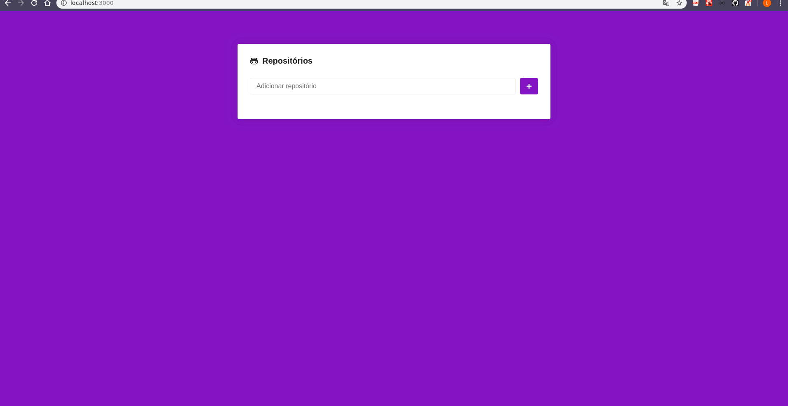

# Uso
Necessário: Possuir o node instalado (Com o gerenciador yarn).

Para rodar o resultado abaixo, basta seguir os seguintes passos:
- Clonar o repositório;
- Navegar até o diretório do módulo05;
- Executar o seguinte comando ```yarn``` no terminal (dentro do diretório) - Isto instala todos os pacotes necessários
- Executar o script yarn start.

O navegador deve abrir com o resultado gravado no gif abaixo.


----
# Resultado

<h1 align="center">
  
</h1>
